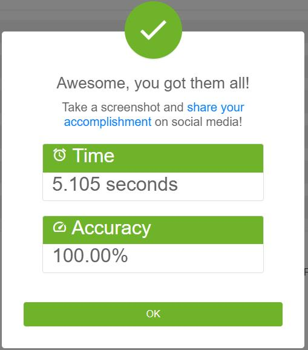
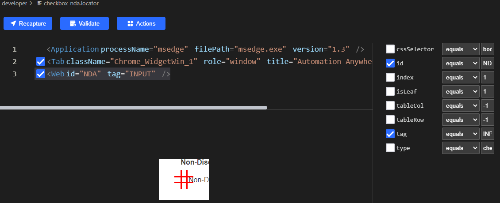

# Sample to demostrate clicknium web automation solution - customer onboarding

This is a sample of customer onboarding solution through [clicknium](https://www.clicknium.com/) web automation.

For one enterprise, customer onboarding has a significant impact on whether a customer keeps using your product or not, you may define the customer onboarding process in your comany internally, for example, need add new customer information into CRM(customer relationship management) system. If you can automatically to do customer onboarding process, it should improve the efficiency significantly.
Here we demo one custoemr onboarding automation solution: 
- load the missing customer's information from CSV file.
- open CRM system.
- iterate the records in CVS file, fill into CRM form and register each customer.

# Run this sample
- follow [clicknium getting started](https://www.clicknium.com/) to set up develop environment.
- clone [sample repo](https://github.com/clicknium/clicknium-samples).
```
git clone https://github.com/clicknium/clicknium-samples.git
```
- open the folder 'CustomerOnboarding' in Visual Studio code
- through `pip` install the dependenct packages
  
`requests` is used to download the CSV file and `pandas` is used to read CSV file.

```
pip install requests
pip install pandas
```

- open `app.py` in Visual Studio Code.
- press `F5` to debug the sample or press `CTRL+F5` to run sample.

You will see the result:



# What the sample do
- open the testing CRM web portal.
- get the url of CSV to be download.
- download the CSV file.

```python
tab = cc.edge.open("https://developer.automationanywhere.com/challenges/automationanywherelabs-customeronboarding.html")
url = tab.find_element(locator.customeronboarding.developer.a_downloadcsv).get_property("href")
excelFile = requests.get(url)
temp_file = os.path.join(os.getcwd(), 'missing.csv')
open(temp_file, 'wb').write(excelFile.content)
data = pd.read_csv(temp_file)
```

- iterate the records and fill the data into CRM system and register the customer.

```python
for idx, item in data.iterrows():
tab.find_element(locator.customeronboarding.developer.text_customername).set_text(item[0])
tab.find_element(locator.customeronboarding.developer.text_customerid).set_text(item[1])
tab.find_element(locator.customeronboarding.developer.text_primarycontact).set_text(item[2])
tab.find_element(locator.customeronboarding.developer.text_street).set_text(item[3])
tab.find_element(locator.customeronboarding.developer.text_city).set_text(item[4])
tab.find_element(locator.customeronboarding.developer.select_state).select_item(item[5])
tab.find_element(locator.customeronboarding.developer.text_zip).set_text("%05d" % item[6])
tab.find_element(locator.customeronboarding.developer.email_email).set_text(item[7])
if item[8] == "YES":
    tab.find_element(locator.customeronboarding.developer.radio_activediscountyes).set_checkbox()
else:
    tab.find_element(locator.customeronboarding.developer.radio_activediscountno).set_checkbox()
        
if item[9] == "YES":
    nda = 'check'
else:
    nda = 'uncheck'
tab.find_element(locator.customeronboarding.developer.checkbox_nda).set_checkbox(check_type=nda)
tab.find_element(locator.customeronboarding.developer.button_submit_button).click()
```

From above code, you can see:
- Locator is separate from code, so locator store can be managed independently, if the CRM system is upgrade, locator is changed, just need update the locator store.
- Easy to select option from dropdown list: `tab.find_element(<locator>).select_item(<option>)`
- Easy to check radio button/checkbox: `tab.find_element(<locator>).set_checkbox()`

# Locator
[Locator](https://www.clickcorp.com/documents#automation/locator) is the identifier of UI element, through [clicknium vs code extension](https://marketplace.visualstudio.com/items?itemName=ClickCorp.clicknium) can record/edit the locator.
For this sample, you can open the locator in Visual Studio Code, for example:


Clicknium will automatically select the attribute to identify web element, and show all attributes of this element, if you want to choose other attributes in some case, it is easily to do that is Visual Studio Code.

# Compare with Selenium
- Selenium need download the webdriver which version should exactly match the browser, in this example, my Edge browser version is `103.0.1264.62`, so I need download the same version msedge web driver first.
- Selenium does not support check operation for radion button, need use click instead.
```
driver.find_element('id', 'activeDiscountYes').click()
```

- To select option from dropdown list, need import additional class to wrapper.
```python
from selenium.webdriver.support.select import Select
Select(driver.find_element('id', 'state')).select_by_value(item[5])
```

- Compare the running time
In this sample, need fill 7 records, each record need submit 10 fields. From the log, we can see clicknium is more faster than selenium.
```
[clicknium] Start to fill data:2022-07-21 16:10:15.938903
[clicknium] End to fill data:2022-07-21 16:10:18.460162

[selenium] Start to fill data:2022-07-21 15:08:30.528693
[selenium] End to fill data:2022-07-21 15:08:37.517574
```

# More samples
You can find more automatin sample/solution from [clicknium github samples](https://github.com/clicknium/clicknium-samples)


