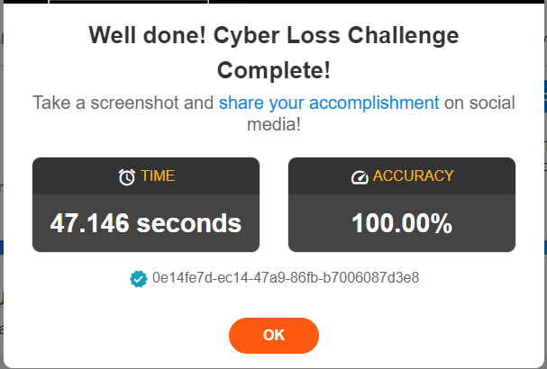
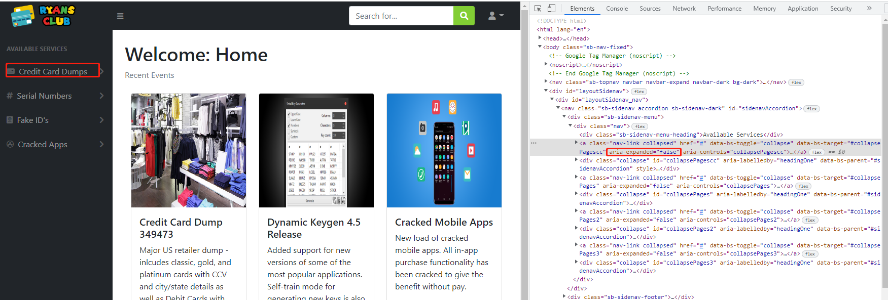
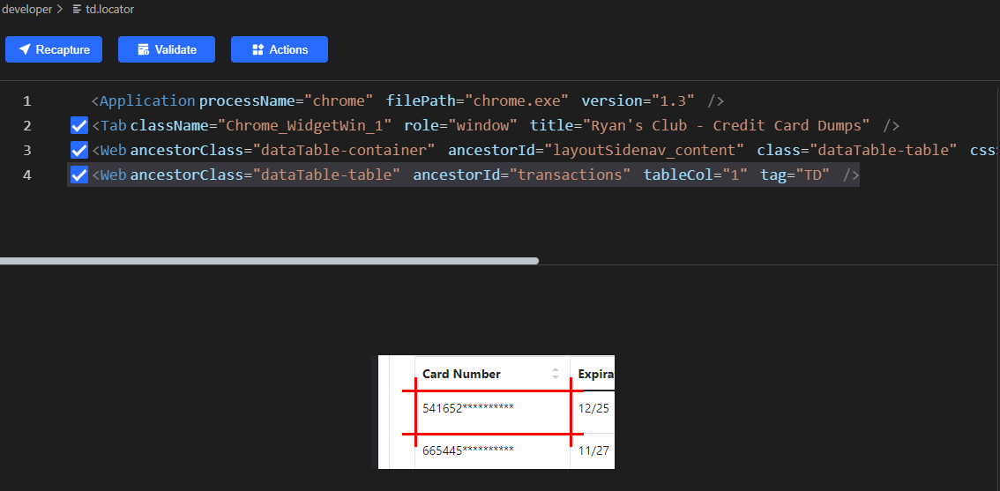
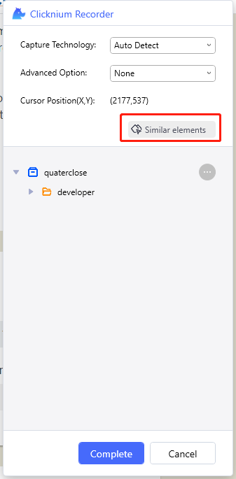
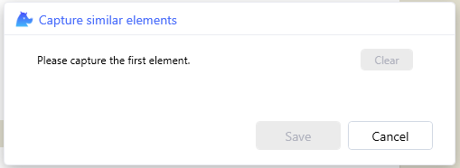
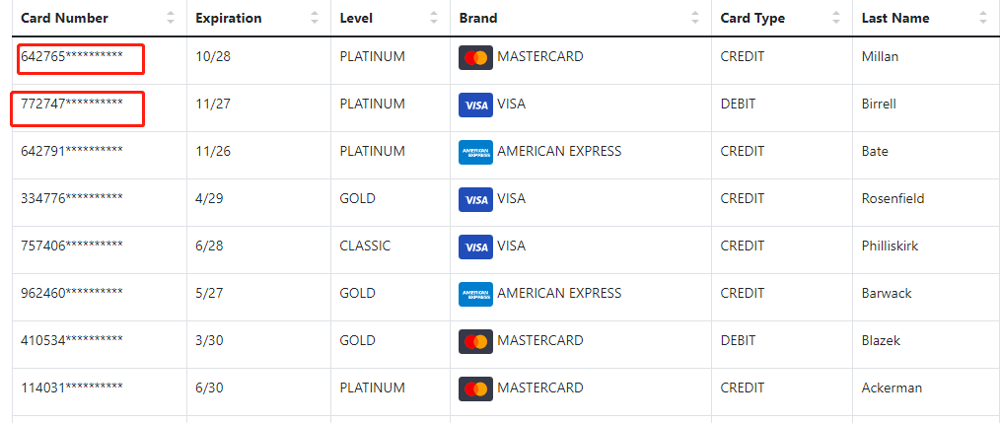
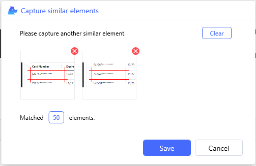
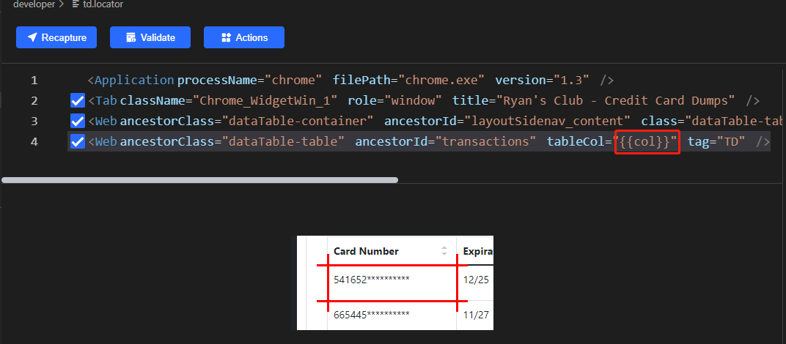

# Clicknium Automation Sample Solution - Cyber Loss Prevention

According to Nilson, the card industry faces $400B in fraud losses over next decade, credit card fraud accounted for [$28.58 Billion](https://www.paymentsdive.com/news/card-industry-faces-400b-in-fraud-losses-over-next-decade-nilson-says/611521/#:~:text=Global%20card%20fraud%20losses%20of,2019%2C%20per%20the%20Nilson%20report.) in losses for global financial institutions in 2020 alone. To combat rampant fraud, the cyber loss prevention team at Eagle One Financial is taking a non-traditional approach to combat losses: scraping credit card dumps from dark web pages in an effort to try to identify compromised accounts.

This is an example of cyber loss prevention automation solution with [clicknium](https://www.clicknium.com/).
It may scrape information from stolen credit cards, compare it to financial customer databases, and then upload a list of accounts whose transactions need to be stopped. Visit [this link](https://developer.automationanywhere.com/challenges/automationanywherelabs-cyberlossprevention.html) for more information.

# Run this sample
- Refer to [Clicknium getting started](https://www.clicknium.com/documents/quickstart) to set up a development environment.
- Clone the [sample repository](https://github.com/clicknium/clicknium-samples).
```
git clone https://github.com/clicknium/clicknium-samples.git
```
- Open the folder 'CyberLossPrevention' in Visual Studio Code.
- Open `sample.py` in Visual Studio Code.
- Press `F5` to debug the sample or press `CTRL+F5` to run sample.
You will see the result as below:



# What the solution do
- Open 'cyberlossprevention' web page
- Click "Ryan's Club login", a new Chrome tab with the login page will open.
- Input the email address and password and click 'Login' button
```python
    tab = cc.chrome.open('https://developer.automationanywhere.com/challenges/automationanywherelabs-cyberlossprevention.html')
    tab.find_element(locator.chrome.developer.a_ryansclublogin).click()
    club_tab = cc.chrome.attach_by_title_url(url='https://developer.automationanywhere.com/challenges/automationanywherelabs-ryansclub*')
    club_tab.find_element(locator.chrome.developer.email_email).set_text('notthecyberteam@gmail.com')
    club_tab.find_element(locator.chrome.developer.password_password).set_text('letme!n')
    club_tab.find_element(locator.chrome.developer.button_login).click()
```
- Click 'Dump 349473' to display the list of stolen credit cards.
Even the 'Credit Card Dumps' menu is collapsed, we still can find the element 'Dump 349473' and click. If you want to fully replicate human behavior, when the "Credit Card Dumps" menu collapsed or expanded, you can inspect the modified properties.  

 

Then the code is as below:
```python
'''
expanded = elem_dumps.get_property('aria-expanded')
if expanded == 'false':
    elem_dumps.click()
'''
club_tab.find_element(locator.chrome.developer.a_dump349473).click()
```
- Wait for the table to appear, and then scrape the credit card data.
To identify all similar elements in this case, we can use the Clicknium 'find elements' api. For instance, locator of Card Number is as follows:



To record similar elements, you can click `Similar elements` in Clicknium Recorder:



The wizard will appear as follows:



You can record (`Ctrl`+click) two or more elements, for example:



It will display the count of matched elements:



In addition to the "Card Number" column, we also need to scrape the "Expiration," "Level," "Brand," "Card Type," and "Last Name" columns, so we can change the locator to [parametric locator](https://www.clicknium.com/documents/concepts/parametric_locator) without repeating the steps above..




```python
club_tab.wait_appear(locator.chrome.developer.td, {'col':1})

card_data = []

has_data = True
while has_data:
    elems_num = club_tab.find_elements(locator.chrome.developer.td, {'col':1})
    elems_expiration = club_tab.find_elements(locator.chrome.developer.td, {'col':2})
    elems_level = club_tab.find_elements(locator.chrome.developer.td, {'col':3})
    elems_brand = club_tab.find_elements(locator.chrome.developer.td, {'col':4})
    elems_type = club_tab.find_elements(locator.chrome.developer.td, {'col':5})
    elems_last_name = club_tab.find_elements(locator.chrome.developer.td, {'col':6})

    count = len(elems_num)
    for idx in range(count):
            card_data.append({'id':elems_num[idx].get_text().replace('*',''),
            'expiration':elems_expiration[idx].get_text(),
            'level':elems_level[idx].get_text(),
            'brand':elems_brand[idx].get_text().strip(),
            'type':elems_type[idx].get_text(),
            'last_name':elems_last_name[idx].get_text()})
        if club_tab.is_existing(locator.chrome.developer.a):
            club_tab.find_element(locator.chrome.developer.a).click()
        else:
            has_data = False
```
- Compare with financial database
```python
def query_and_fill_csv(card_data):
    cards = []
    conn = None
    try:
        conn = sqlite3.connect("CustomerData.db")
    except sqlite3.Error as e:
        print(e)
    sql = "SELECT c.id as id, d.first_name as first_name, d.last_name as last_name, c.card_number as card_number, c.cvv as cvv, c.brand as brand \
    FROM card_details as c inner join customer_details as d \
    where c.id=d.customer_id and c.level=\"{level}\" and c.expiration=\"{expiration}\" and c.card_type=\"{type}\" \
    and d.last_name=\"{last_name}\" and c.brand=\"{brand}\" and c.card_number like \"{id}%\""
    
    cols = ["CustomerID", "FirstName", "LastName", "CardNumber", "CVV", "CardBrand"]
    for item in card_data:
        cur = conn.cursor()
        cur.execute(sql.format(level=item['level'], expiration=item['expiration'], type=item['type'], last_name=item['last_name'], brand=item['brand'], id=item['id']))
        row = cur.fetchone()
        if row != None:
            cards.append([row[0], row[1], row[2], row[3], row[4], row[5]])

    with open('result.csv', 'w') as f:
        # using csv.writer method from CSV package
        write = csv.writer(f)

        write.writerow(cols)
        write.writerows(cards)
```
- Upload the csv file and get result.
For 'file upload' input, we need click by 'mouse-emulation'.

```python
tab.find_element(locator.chrome.developer.file_filetoupload).click(by='mouse-emulation')
ui(locator.chrome.edit_1148).set_text(os.path.join(os.getcwd(), 'result.csv'), by='set-text')
ui(locator.chrome.button_1).click(by='control-invocation')
sleep(2)
tab.find_element(locator.chrome.developer.button_btnuploadfile).click()
```
# Locator
The [Locator](https://www.clicknium.com/documents/concepts/locator) is the identifier of UI element, which can be recorded and edited with [clicknium vs code extension](https://marketplace.visualstudio.com/items?itemName=ClickCorp.clicknium).

# More samples
Additional automation examples and solutions are available in [clicknium github samples](https://github.com/clicknium/clicknium-samples).
Send [email](mailto:support@clicknium.com) to us or [Join Slack](https://join.slack.com/t/clicknium/shared_invite/zt-1cfxsstw7-s0CeJdhyg5wQ1h7_KKc6QQ).
