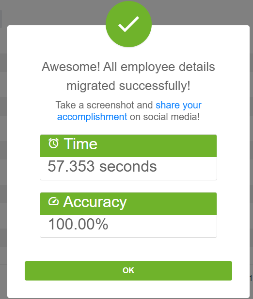
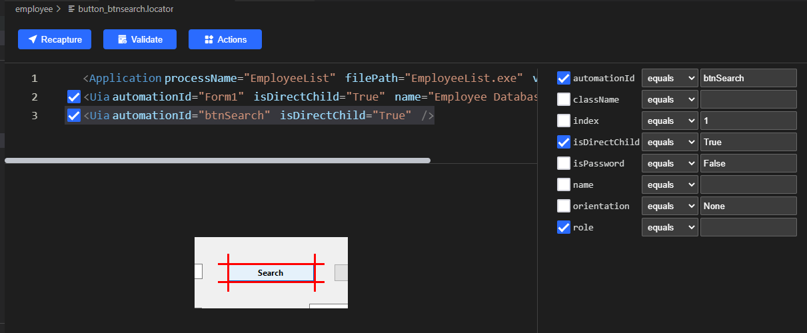

# Clicknium automation sample solution - Data migration

Many enterprise needs data migration solution, for example, if IT system is upgraded, need migrate data from legacy system to new system.
This is a sample for employee data migration solution through [clicknium](https://www.clicknium.com/) desktop&web automation.
The detail of problem is: migrate employee data from a legacy thick client application into new HR system.
The manual steps are as the following:
- query data from legacy client app based on employee id.
- query more meta data of employee through internal REST API.
- fill the data of employee to the new HR system(web portal).

# Run this sample
- follow [clicknium getting started](https://www.clicknium.com/documents) to set up develop environment.
- clone this sample repo
- download and unzip [legacy thick client app](https://github.com/AutomationAnywhere/Employee-Data-Migration/raw/master/EmployeeList.zip) to local repo folder.
- clone [sample repo](https://github.com/clicknium/clicknium-samples).
```
git clone https://github.com/clicknium/clicknium-samples.git
```
- open the folder 'EmployeeDataMigration' in Visual Studio code
- through `pip` install the dependenct packages
  
`requests` is used to query data through internal REST api.

```
pip install requests
```
- open `app.py` in visual studio code.
- press `F5` to debug the sample or press `CTRL+F5` to run sample.
You will see the result:



# What the sample do
- open the legacy client application through subprocess module, it will be used to query data later.

```
current_dir = os.path.dirname(os.path.abspath(__file__))
employeeList_exe = os.path.join(current_dir, "EmployeeList.exe")
process = subprocess.Popen(employeeList_exe)
```

- through clicknium python module to open browser, open new HR system, the sample uses microsoft edge browser.
  
```
tab = cc.edge.open("https://developer.automationanywhere.com/challenges/automationanywherelabs-employeedatamigration.html")
```
after browser is opened, will return the edge tab/page.

- through clicknium web automaton, get the employee id in new HR system.

```
employee_id = tab.find_element(locator.employeedatamigration.developer.text_employeeid).get_text()
```

-  based the captured employee_id above, through clicknium desktop automation, find the employee information on legacy client application.

```python
cc.ui(locator.employeedatamigration.employee.edit_txtempid).set_text(employee_id, by='set-text')
cc.ui(locator.employeedatamigration.employee.button_btnsearch).click(by='control-invocation')
item["first_name"] = cc.ui(locator.employeedatamigration.employee.edit_txtfirstname).get_text()
item["last_name"] = cc.ui(locator.employeedatamigration.employee.edit_txtlastname).get_text()
item["email_id"] = cc.ui(locator.employeedatamigration.employee.edit_txtemailid).get_text()
item["city"] = cc.ui(locator.employeedatamigration.employee.edit_txtcity).get_text()
... ...
```

automatically set text for employee_id, then click search button, finally capture all information such as first_name, last_name etc of this emplyee.
For desktop application operation, clicknium use mouse&keyboard simulation defaultly, for this legacy application, the input and button control support control invocation, so we can use it by pass parameter `by` in click and set_text api.

- through `requests` module, send http request to get the extra informaton(phone number, start date) about the employee.

```python
response = requests.get(api_url + employee_id)
print(datetime.datetime.now().strftime("%H:%M:%S") + " get response")
obj = json.loads(response.content.decode('UTF-8'))
item["phoneNumber"] = obj["phoneNumber"]
item["startDate"] = obj["startDate"]
```

- fill the data into new HR system through clicknium web automation.
```python
tab.find_element(locator.employeedatamigration.developer.text_firstname).set_text(item["first_name"])
tab.find_element(locator.employeedatamigration.developer.text_lastname).set_text(item["last_name"])
tab.find_element(locator.employeedatamigration.developer.text_phone).set_text(item["phoneNumber"])
tab.find_element(locator.employeedatamigration.developer.text_email).set_text(item["email_id"])
... ...
tab.find_element(locator.employeedatamigration.developer.button_submitbutton).click()
```

From above code, you can see:
- Locator is separate from code, so locator store can be managed independently, if the new HR system is upgrade, locator is changed, just need update the locator store.
- Clicknium supply unified API for both desktop and web automation, so you can use the same way to write automation code for browser, windows application.

# Locator
[Locator](https://www.clicknium.com/documents/automation/locator) is the identifier of UI element, through [clicknium vs code extension](https://marketplace.visualstudio.com/items?itemName=ClickCorp.clicknium) can record/edit the locator.

For this sample, you can open the locator in Visual Studio Code, for example:


# Compare with Selenium & Playwright
- Selenium need download the webdriver which version should exactly match the browser, in this example, my Edge browser version is `103.0.1264.62`, so I need download the same version msedge web driver first.
- Selenium and playwright can only do web automation, so for this employee data migration solution, you need use another library such as pywinauto to do operation on legacy client app.

# More samples
You can find more automatin sample/solution from [clicknium github samples](https://github.com/clicknium/clicknium-samples)