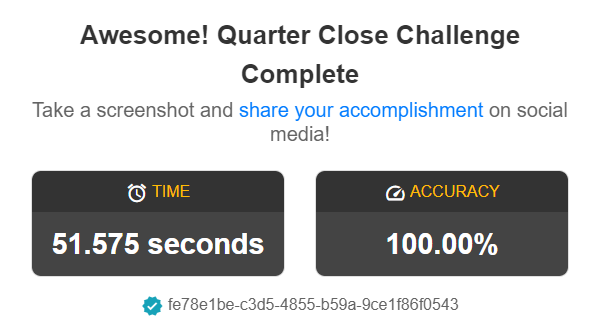
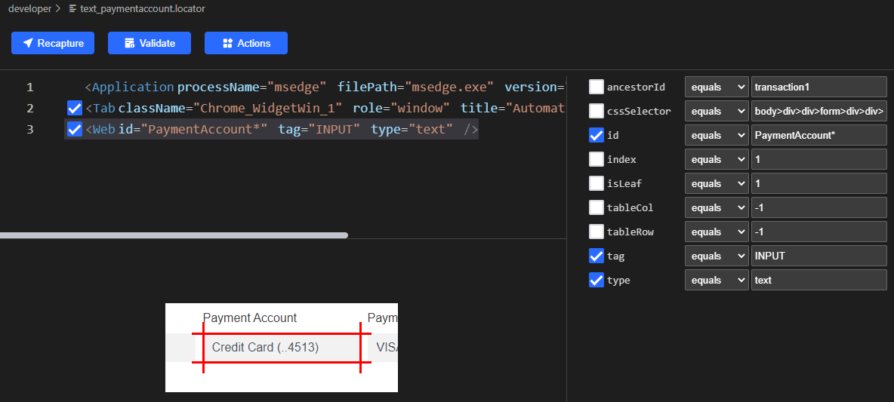
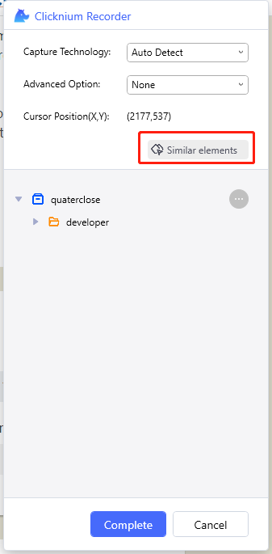
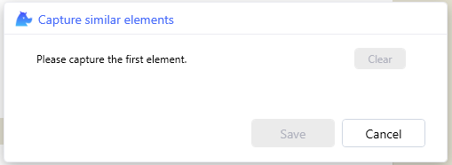
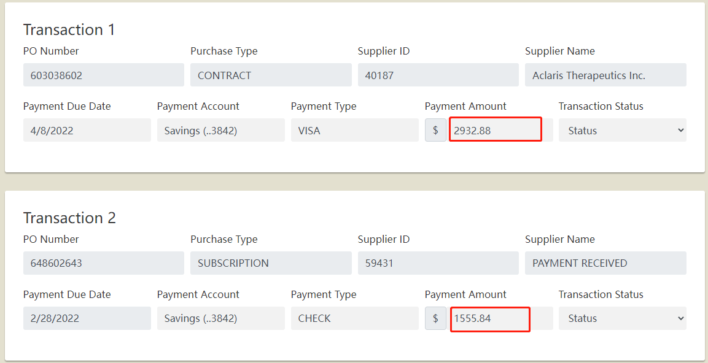
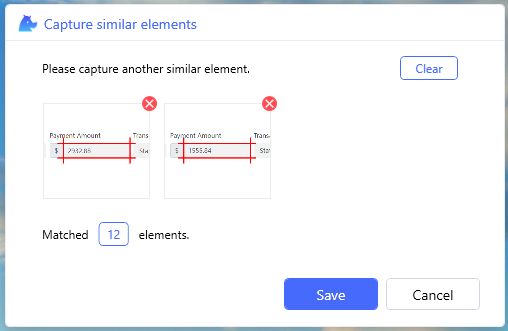

# Clicknium Automation Sample Solution - Finance Quarter Close

For many enterprises, at the end of each fiscal quarter, the finance team spends much time making all of the financial obligations fulfilled.
This is a sample of financial quarter close solution with [clicknium](https://www.clicknium.com/) automation.
It can review transactions automatically.
Here is the details: go through transactions in local financial system to find the matching transaction in the Bank system. If the match is found, change the `Transaction Status` to `Verified` in local financial system.

The manual steps are as follows:
- login to local financial system.
- Query the transactions in this quarter.
- login to the bank system.
- For each transaction:
  - based on `Payment Account`, navigate to corresponding page.
  - search 'Payment Amount'.
  - If the matched one is found, go back to local financial system, set the `Transaction Status` to Verified.
- After all transactions are reviewed, click `Submit` button in local financial system.

# Run this sample
- follow [clicknium getting started](https://www.clicknium.com/documents/quickstart) to set up develop environment.
- clone [sample repo](https://github.com/clicknium/clicknium-samples).
```
git clone https://github.com/clicknium/clicknium-samples.git
```
- open the folder 'QuarterCloseChallenge' in Visual Studio Code
- open `app.py` in Visual Studio Code.
- press `F5` to debug the sample or press `CTRL+F5` to run sample.
You will see the result as below:



# The Purpose of The Sample
- open local financial system to get the transaction count and scrape `Amount` and `Account` information for each transaction.

```python
def get_transaction_count():
    transaction = []
    tab = cc.edge.open("https://developer.automationanywhere.com/challenges/automationanywherelabs-quarterclose.html", is_wait_complete=True, timeout=60)
    if tab.is_existing(locator.quaterclose.developer.button_onetrust_accept_btn_handler):
        tab.find_element(locator.quaterclose.developer.button_onetrust_accept_btn_handler).click()
    elems1 = tab.find_elements(locator.quaterclose.developer.text_paymentaccount)
    elems2 = tab.find_elements(locator.quaterclose.developer.text_paymentamount)
    count = len(elems1)
    for i in range(count):
        account = elems1[i].get_text()
        amount = elems2[i].get_text()
        transaction.append({"Amount":amount, "Account":account, "Status":"Unverified"})
    return tab,transaction
```

Here we leverage Clicknium `find_elements` api to find all similar elements. For example, for element's locator of PO number:



To record similar elements, you can click `Similar elements` in Clicknium Recorder:



The wizard will be shown as below:



You can record (`Ctrl`+click) two or more elements, for example:



It will show the counts of matched elements:



- open bank system and login
- iterate the transactions and go to the corresponding account page based on each transaction's account
- search the transaction's amount, and if the matched one is found, mark the transaction state as Verified.

```python
def validate_transaction(transaction):
    bank_tab = cc.edge.open("https://developer.automationanywhere.com/challenges/automationanywherelabs-arcadiabanklogin.html", is_wait_complete=True, timeout=60)
    bank_tab.find_element(locator.quaterclose.developer.email_inputemail).set_text("tammy.peters@petersmfg.com")
    bank_tab.find_element(locator.quaterclose.developer.password_inputpassword).set_text("arcadiabank!")
    bank_tab.find_element(locator.quaterclose.developer.a_login).click()
    for item in transaction:
        bank_tab.find_element(locator.quaterclose.developer.a_action, {"account":item["Account"]}).click()
        bank_tab.wait_appear(locator.quaterclose.developer.table1)
        bank_tab.find_element(locator.quaterclose.developer.text).set_text(item["Amount"])
        if bank_tab.is_existing(locator.quaterclose.developer.td_amount, {"amount":item["Amount"]}):
            item["Status"] = "Verified"
    bank_tab.close()
```

- go back to local financial system and  batch update transactions state.

```python
def update_transaction_status(tab: BrowserTab, transaction):
    elems = tab.find_elements(locator.quaterclose.developer.select_status)
    count = len(elems)
    for i in range(count):
        elems[i].select_item(transaction[i]["Status"])

    tab.find_element(locator.quaterclose.developer.button_submitbutton).click()
```

# Locator
The [Locator](https://www.clicknium.com/documents/concepts/locator) is the identifier of UI element, which can be recorded and edited with [clicknium vs code extension](https://marketplace.visualstudio.com/items?itemName=ClickCorp.clicknium).

# Compare with Playwright
- You need to write xpath to get similar elements.
```python
elems1 = page.query_selector_all("//*[contains(@id,'PaymentAccount')]")
elems2 = page.query_selector_all("//*[contains(@id,'PaymentAmount')]")
```
- You need to fill the text to search the transaction item by pressing Enter as well.
```python
bank_page.locator("[placeholder=\"Search\\.\\.\\.\"]").fill(item["Amount"])
bank_page.press("[placeholder=\"Search\\.\\.\\.\"]",'Enter')
```

# More samples
You can refer to more automation samples and solutions in [clicknium github samples](https://github.com/clicknium/clicknium-samples).
Send [email](mailto:support@clicknium.com) to us or [Join Slack](https://join.slack.com/t/clicknium/shared_invite/zt-1cfxsstw7-s0CeJdhyg5wQ1h7_KKc6QQ).


