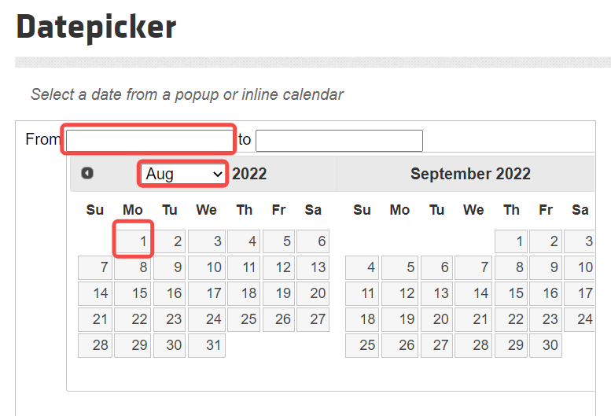
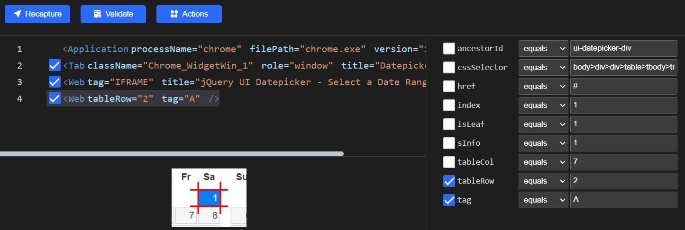
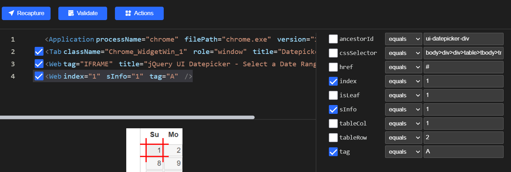
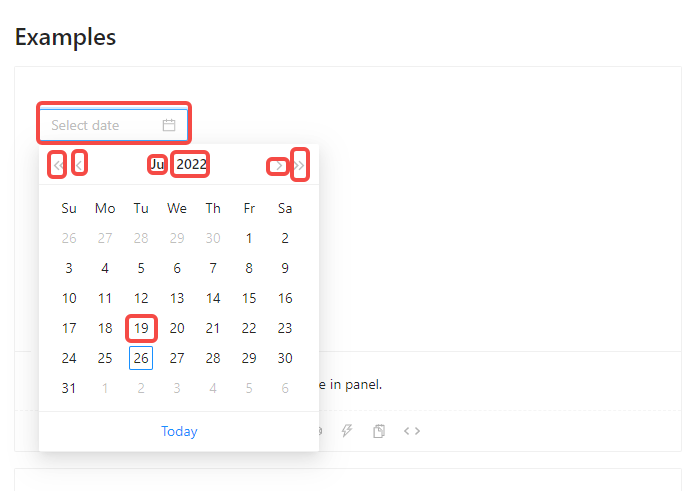
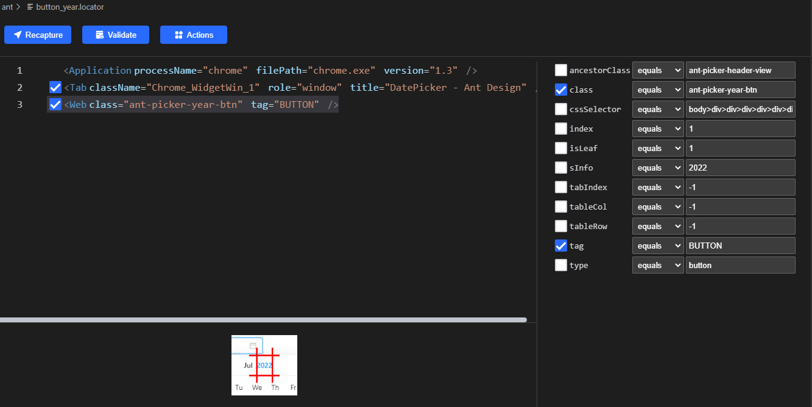
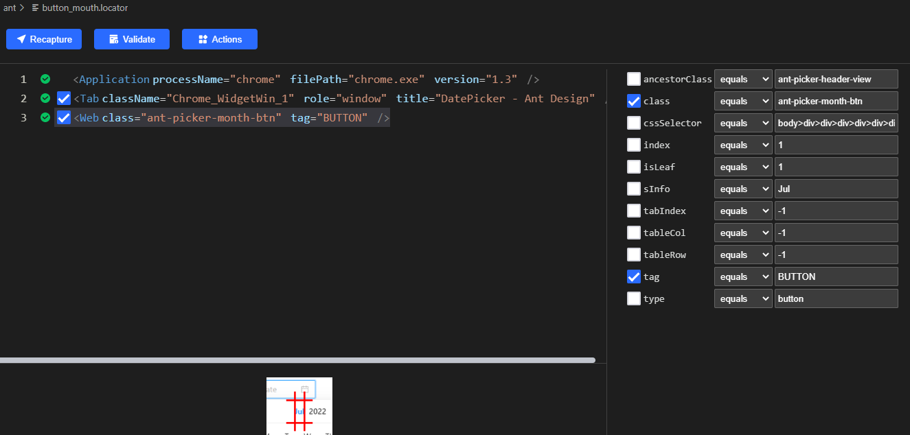
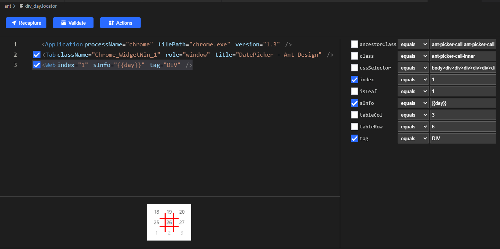

# [Clicknium-calendar]如果通过自动化对日期选择框设值
# [Clicknium-calendar]How to Set Values for Date Picker by Automation
## 引言 Introduction
前端日期取值设值是自动化中比较常见的需求。但前端组件库较多，每种框架都有所不同，那我们来看看clicknium是如果实现多种前端UI框架中日期相关的操作。
It is a common requriremnt to set date values at front-end. But there are a lot of component libraries with different frameworks. So let's take a look at how Clicknium implements date-related operations in a variety of front-end UI frameworks.
- PS: Clicknium Automation安装基础使用参考 [官方文档](https://https://www.clicknium.com/documents)
-Notes: More about the installation and the tutorial of Clicknium Automation, please refer to (https://https://www.clicknium.com/documents).

## CalendarUI控件种类 The Types of Calendar UI Control

### jQueryUI Calendar 
基于jQuery的UI库。[官方文档](https://jqueryui.com/datepicker/#date-range)
The UI repository based on jQuery. For more information, please refer to (https://jqueryui.com/datepicker/#date-range).

### Ant Design
基于React的UI库。[官方文档](https://ant.design/components/date-picker/) 
The UI repository based on React. For more information, please refer to (https://ant.design/components/date-picker/).

- ps: clicknium基于Web的录制除IE外需要按照浏览器插件。安装步骤参考 [Clicknium 浏览器插件](https://www.clicknium.com/documents/developtools/vscode/extensions/)
-Notes: The Web Recorder in Clicknium requires a browser plugin in addition to IE browser. More about the installation, please refer to [Clicknium browser plugin] (https://www.clicknium.com/documents/developtools/vscode/extensions/) 


## How To Automate Calendar In Clicknium For Automation Testing?

### JqueryUI Calendar
1. 通过clicknium提供的录制器，录制页面中需要操作的组件元素。
With the Clicknium recorder, the component elements operated in recording the page.
   clicknium提供了非常强大的录制功能。  
   Clicknuim provides an excellent recording.
   具体操作可参照 [Clicknium 录制器](https://www.clicknium.com/documents/developtools/vscode/extensions/)  
   For more information, please refer to [Clicknium Recorder](https://www.clicknium.com/documents/developtools/vscode/extensions/).
 
   这里我们录制内容如图。
   Here is the content recorded as below.
  
   to参考from也录制这三部分。
   Three parts of "TO" are recored the same way as "FROM".

2. 修改日期locator。因为自动录制是按照日期所在table的行列生成的，每个月日期对应的行列有所不同，不能准确定位。这里我们将日期元素修改成根据sinfo和index来定位。
Change the locator of the date. As automatic recording is generated according to rows and columns of the table where the date is located, the rows and columns of the dates in each month are different and cannot be accurately located.  Here we change the date element to be located by sinfo and index. 
   修改前 Before:
    
   修改后 After：
    
3. 准备工作做好后，我们可以上代码了。
When the loctor is changed, we write the code as below.
   ```python
   from clicknium import clicknium, ui, locator

   clicknium.chrome.open("https://jqueryui.com/datepicker/#date-range")

   ui(locator.chrome.jqueryui.text_from).set_focus()
   ui(locator.chrome.jqueryui.select_from).select_item("Jan")
   ui(locator.chrome.jqueryui.a_1_from).click()

   ui(locator.chrome.jqueryui.text_to).set_focus()
   ui(locator.chrome.jqueryui.select_to).select_item("Dec")
   ui(locator.chrome.jqueryui.a_31_to).click()
   ```

### Ant Design
1. 思路：Steps
   点击输入框，弹出日期选择popup。 
   Click the input box to pop up the date picker.
   比较输入值的年是否一致，不一致通过上一年下一年，进行调整。月份同理。
   Compare the input values for the year. If they are not same, adjust the input values to the next year or last year .Same for the month. 
   
   年月一致后，找到对应天的元素，最后点击此元素。
   When the year and the month are same, find and click the element of the day.
   
1. 通过clicknium提供的录制器，录制页面中需要操作的组件元素。  
With the Clicknium recorder,the component elements operated in recording the page.
   录制元素如图。
   The recorded elements are shown as below.
    
2. 修改text.locator,因为页面中有多个Examples，这里勾上index。  
Change text.locator. The index needs to be checked as there are several Examples in the page.
   修改年月、日对应的locator。年月把sInfo定位换成class属性来定位。日的sInfo换成变量day。
   Change the locators of the year, the month and the day. Locate the year and the month with the class attribute instead of the sInfo. Locate the day with the variable day instead of sInfo.
   修改后 After changing
    
    
    
3. 上代码 Write the code as below.
   
   ```python
   from clicknium import clicknium, ui, locator

   # 输入项 Input
   year = '2010'
   mouth = 'Jan'
   day = '1'

   # 对应日期控件中月份常量 The month corresponding to the date control
   months = ['Jan', 'Feb', 'Mar', 'Apr', 'May', 'Jun', 'Jul', 'Aug', 'Sep', 'Oct', 'Nov', 'Dec']

   # 打开页面 Open the page
   clicknium.chrome.open("https://ant.design/components/date-picker/")

   # 点击日期输入框 Click the date input
   ui(locator.chrome.ant.text).mouse_down()

   # 比较年份是否一致，不一致的情况通过上一年，下一年按钮调整，直到一致 Compare the year. If not same, adjust to the next year or last year by clicking the button until they are same.
   locator_year = ui(locator.chrome.ant.button_year)
   current_year = locator_year.get_property(name="sInfo")

   while year != current_year:
      if year > current_year:
         ui(locator.chrome.ant.button_year_next).click()
      else:
         ui(locator.chrome.ant.button_year_pre).click()
      current_year = locator_year.get_property(name="sInfo")

   # 比较月份是否一致，不一致的情况通过上一月，下一月按钮调整，直到一致 Compare the month. If not same, adjust to the next month or last month by clicking the button until they are same.
   locator_mouth = ui(locator.chrome.ant.button_mouth)
   current_mouth = locator_mouth.get_property(name="sInfo")
   current_mouth_index = months.index(current_mouth)
   mouth_index = months.index(mouth)

   while current_mouth_index != mouth_index:
      if mouth_index > current_mouth_index:
         ui(locator.chrome.ant.button_mouth_next).click()
      else:
         ui(locator.chrome.ant.button_mouth_pre).click()
      current_mouth = locator_mouth.get_property(name="sInfo")
      current_mouth_index = months.index(current_mouth)

   # 用日期变量定位到对应的日期元素，并点击  locate the date element with the date variable and click it.
   ui(locator.chrome.ant.div_day, {"day": day }).click()
   ```
