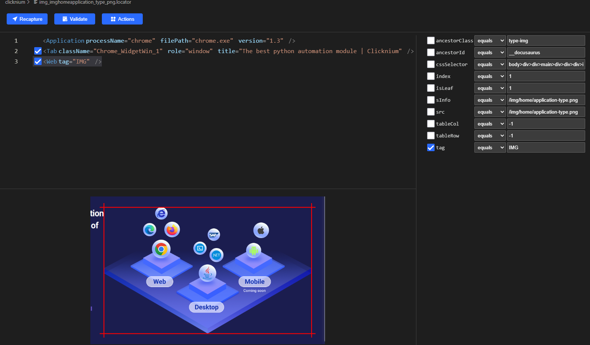

# [Clicknium-scrape-image]How to scrape images from website

## Introduction
通过Python抓取website中的images是比较常见的需求。It isn't just a tool for sharpening your programming skills.  
以抓取[Clicknium website](https://www.clicknium.com)中的图片为例，Learn how to scrape images from any website using Clicknium.

-Notes: More about the installation and the tutorial of Clicknium Automation, please refer to [here](https://www.clicknium.com/documents).

## How to?
1. With the Clicknium recorder, 录制Clicknium website中一个图片.
2. 修改图片locator，为了通用，这里我们去掉其它属性选项只保留tag.
 
3. When the locator is changed, we write the code as below.
   ```python
    from clicknium import clicknium, locator
    import requests

    websiteUrl = "https://www.clicknium.com"
    tab = clicknium.chrome.open(websiteUrl)

    imgs = clicknium.find_elements(locator.chrome.clicknium.img)

    sources = []
    for img in imgs:
    source = img.get_property("src")
    if source:
            sources.append(source)

    for source in sources:
        webs = requests.get(websiteUrl + source)
        open('images/' + source.split('/')[-1], 'wb').write(webs.content)
   ```