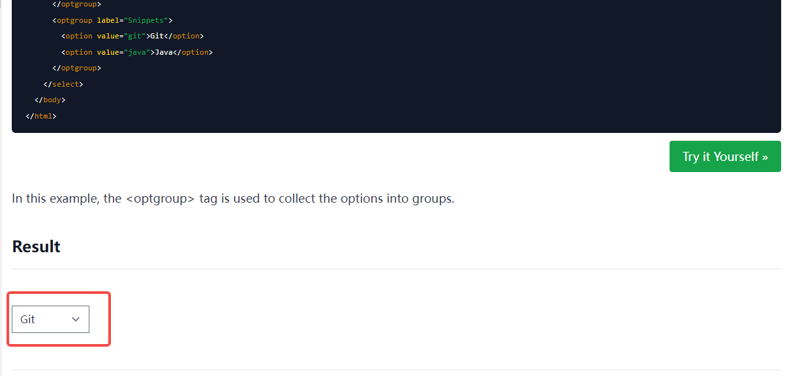
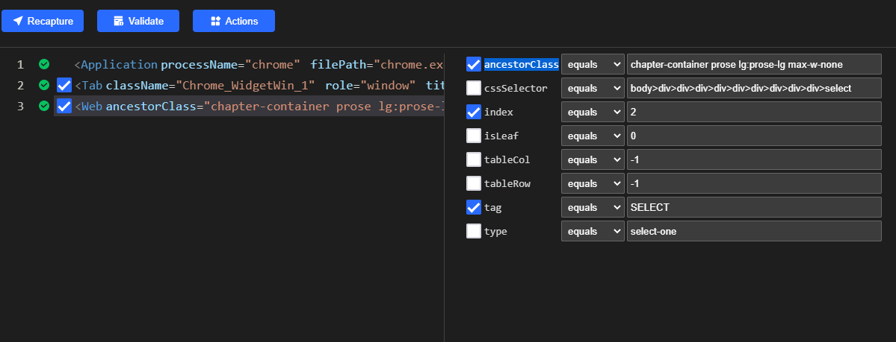
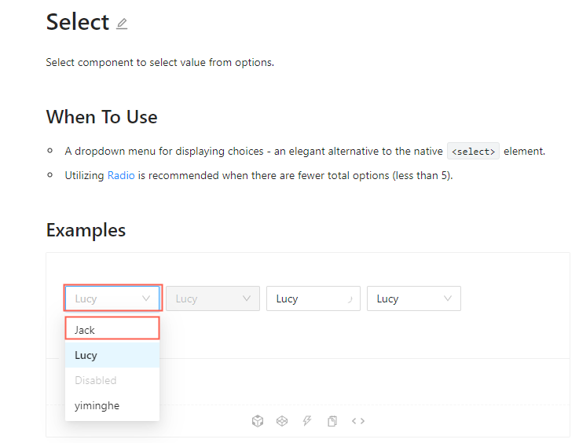
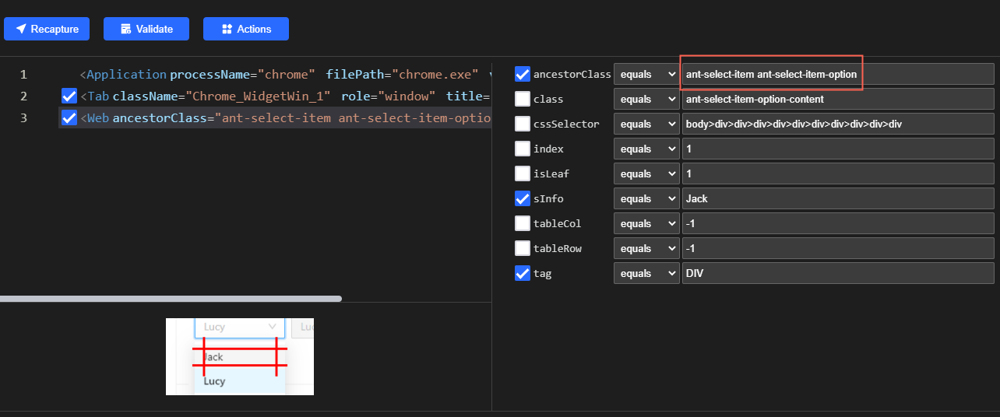

# [Clicknium-select]How to Set Values for Select/Dropdown list by Automation
##  Introduction
It is a common requirement to set date values at website. But there are a lot of component libraries with different frameworks. So let's take a look at how Clicknium implements select-related operations in a variety of web UI frameworks.  
- Notes: More about the installation and the tutorial of Clicknium Automation, please refer to [here](https://www.clicknium.com/documents).

## The Types of Select/Dropdown UI Control

### HTML Select tag 
The Select HTML tag represents a control that provides a menu of options.

### Ant Design
The UI repository based on React. For more information, please refer to [here](https://ant.design/components/select/).  
- Notes: The Web Recorder in Clicknium requires a browser plugin in addition to IE browser. More about the installation, please refer to [Clicknium browser plugin](https://www.clicknium.com/documents/tutorial/extensions/) 


## How To Automate Calendar In Clicknium For Automation Testing?

### HTML Select tag
1. With the Clicknium recorder, the component elements operated in recording the page.   
   Clicknium provides an excellent recording.  
   For more information, please refer to [Clicknium Recorder](https://www.clicknium.com/documents/tutorial/recorder/).
 
   Here is the content recorded as below.
  
   

1. Change the locator of the select.  Here we change the date element to be located by ancestorClass and index. 
    
2. When the locator is changed, we write the code as below.
   ```python
   from clicknium import clicknium, ui, locator

   clicknium.chrome.open("https://www.w3docs.com/learn-html/html-select-tag.html")
   ui(locator.chrome.w3docs.select).select_item("Git")
   ```

### Ant Design
1. With the Clicknium recorder,the component elements operated in recording the page.  
   The recorded elements are shown as below.
    
2. Change the locator of the option. Delete className of ancestorClass, which one when option active. 
   After changing
    

3. Write the code as below.
   
   ```python
   from clicknium import clicknium, ui, locator

   clicknium.chrome.open("https://ant.design/components/select/")

   ui(locator.chrome.ant.select).click()
   ui(locator.chrome.ant.option_jack).click()
   ```
