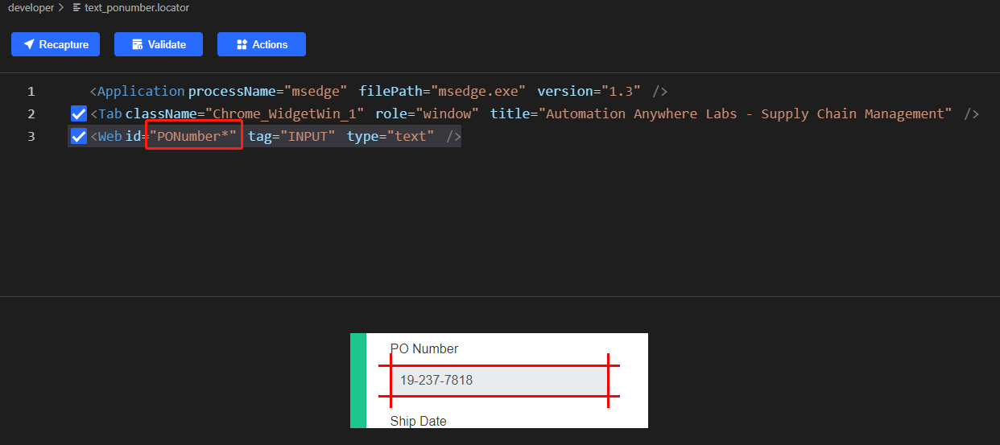

# Sample to demostrate clicknium web automation interactive with Excel data

This is a sample to solve Purchase Orders data management through [clicknium](https://www.clickcorp.com) web automation.
The detail of problem is: based on PO number, find and capture data from another `Purchase Order Tracking` web app, and look up state for agent from one excel, finally fill the data to PO management web portal.
The manual steps are as the following:
- download excel from PO management portal.
- copy PO number from web portal.
- login and query PO data based on PO number.
- look up the agent info from excel based on state.
- fill the PO data into PO management portal.


# run this sample
- follow [clicknium getting started](https://www.clickcorp.com/documents?source=github) to set up develop environment.
- clone this sample repo.
- open `app.py` in visual studio code.
- press `F5` to debug the sample or press `CTRL+F5` to run sample.

# what the sample do
- open PO management portal, and capture the excel download url.
- through `requests` module to download excel file.
- through `pandas` module to load data from excel file. 

```python
tab = cc.edge.open("https://developer.automationanywhere.com/challenges/automationanywherelabs-supplychainmanagement.html")
url = tab.find_element(locator.supplychainmanagement.developer.a_downloadagentterritoryspreadsheet).get_property("href")
excelFile = requests.get(url)
temp_file = os.path.join(os.getcwd(), 'test.xlsx')
open(temp_file, 'wb').write(excelFile.content)
data = pd.read_excel(temp_file,header=1)
```

- open `Purchas Order Tracking` web app and login
  
```
proc_tab = cc.edge.open("https://developer.automationanywhere.com/challenges/AutomationAnywhereLabs-POTrackingLogin.html")
proc_tab.find_element(locator.supplychainmanagement.developer.email_inputemail).set_text("admin@procurementanywhere.com")
proc_tab.find_element(locator.supplychainmanagement.developer.password_inputpassword).set_text("paypacksh!p")
proc_tab.find_element(locator.supplychainmanagement.developer.button_signin).click()
```
after browser is opened, will return the edge tab/page.

- through clicknium web automaton, find all elements for each PO item: PO number, Ship date, Order total and Assigned agent.

```
po_elements = tab.find_elements(locator.supplychainmanagement.developer.text_ponumber)
date_elements = tab.find_elements(locator.supplychainmanagement.developer.text_shipdate)
total_elements = tab.find_elements(locator.supplychainmanagement.developer.text_ordertotal)
agent_elements = tab.find_elements(locator.supplychainmanagement.developer.select_agent)
count = len(po_elements)
```

here we leverage clicknium `find_elements` api, it can find all similiar elements. For example, for PO number element's locator:



we set the value of id to `PONumber*`, it will match all elements with id start with `PONumber`.

- iterate each PO number elements: capture PO number, query data from `Purchas Order Tracking` web app, fill the data in web portal and submit finally

```
for i in range(count):
po = po_elements[i].get_text()
proc_tab.find_element(locator.supplychainmanagement.developer.search).set_text(po)
state = proc_tab.find_element(locator.supplychainmanagement.developer.td, {"column":5}).get_text()
ship_date = proc_tab.find_element(locator.supplychainmanagement.developer.td, {"column":'7'}).get_text()
total = proc_tab.find_element(locator.supplychainmanagement.developer.td, {"column":'8'}).get_text()
for idx,item in data.iterrows():
    if item[0] == state:
        agent = item[1]
        break
    date_elements[i].set_text(ship_date)
    total_elements[i].set_text(total[1:].strip())
    agent_elements[i].select_item(agent)
    
tab.find_element(locator.supplychainmanagement.developer.button_submitbutton).click()
```

# Locator
[Locator](https://www.clickcorp.com/documents#automation/locator) is the identifier of UI element, through [clicknium vs code extension](https://marketplace.visualstudio.com/items?itemName=ClickCorp.clicknium) can record/edit the locator.


