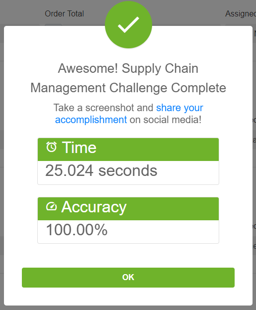
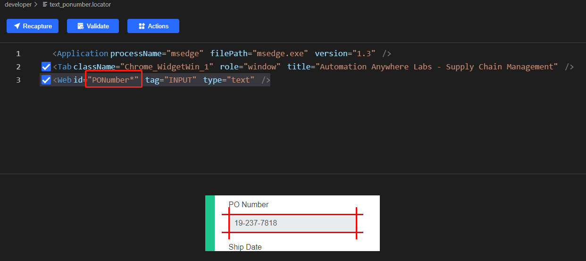
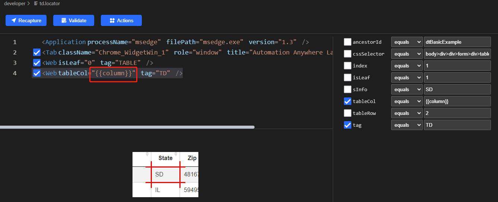

# Clicknium Automation Sample Solution - Supply Chain Management

This is a sample of supply chain solution with [Clicknium](https://www.clicknium.com/) web automation.
Here is the details: based on PO number, find and capture data from another `Purchase Order Tracking` web app and look up the state of the agent from one excel to finally fill the data to PO management web portal.
The manual steps are as follows:
- download excel from PO management portal.
- copy PO number from web portal.
- login and query PO data based on PO number.
- look up the agent information from excel based on the state.
- fill the PO data into PO management portal.


# Run this sample
- follow [clicknium getting started](https://www.clicknium.com/documents) to set up develop environment.
- clone [sample repo](https://github.com/clicknium/clicknium-samples).
```
git clone https://github.com/clicknium/clicknium-samples.git
```
- open the folder 'SupplyChainManagement' in Visual Studio Code
- through `pip` install the dependent packages
  
`requests` is used to download the CSV file and `pandas` is used to read CSV file.

```
pip install requests
pip install pandas
```
- open `app.py` in Visual Studio Code.
- press `F5` to debug the sample or press `CTRL+F5` to run sample.
You will see the result as below.



# The Purpose of The Sample
- open PO management portal to capture the url of the excel to be downloaded.
- download the excel file with `requests` module
- load data from the excel file with `pandas` module 

```python
tab = cc.edge.open("https://developer.automationanywhere.com/challenges/automationanywherelabs-supplychainmanagement.html")
url = tab.find_element(locator.supplychainmanagement.developer.a_downloadagentterritoryspreadsheet).get_property("href")
excelFile = requests.get(url)
temp_file = os.path.join(os.getcwd(), 'test.xlsx')
open(temp_file, 'wb').write(excelFile.content)
data = pd.read_excel(temp_file,header=1)
```

- open `Purchase Order Tracking` web app and login
  
```python
proc_tab = tab.browser.new_tab("https://developer.automationanywhere.com/challenges/AutomationAnywhereLabs-POTrackingLogin.html")
proc_tab.find_element(locator.supplychainmanagement.developer.email_inputemail).set_text('username')
proc_tab.find_element(locator.supplychainmanagement.developer.password_inputpassword).set_text('password')
proc_tab.find_element(locator.supplychainmanagement.developer.button_signin).click()
```
After the browser is opened, it will return to the edge tab/page.

-With Clicknium web automaton, find all elements for each PO item, such as PO number, Ship date, Order total and Assigned agent.

```python
po_elements = tab.find_elements(locator.supplychainmanagement.developer.text_ponumber)
date_elements = tab.find_elements(locator.supplychainmanagement.developer.text_shipdate)
total_elements = tab.find_elements(locator.supplychainmanagement.developer.text_ordertotal)
agent_elements = tab.find_elements(locator.supplychainmanagement.developer.select_agent)
count = len(po_elements)
```

Here we leverage Clicknium `find_elements` api to find all similar elements. For example, for element's locator of the PO number:



When the value of ID is set to `PONumber*`, it will match all elements with ID starting with `PONumber`.

- iterate each PO number element: capture the PO number and query the data from `Purchase Order Tracking` web app to fill the data in web portal by submitting finally

```python
for i in range(count):
po = po_elements[i].get_text()
proc_tab.find_element(locator.supplychainmanagement.developer.search).set_text(po)
state = proc_tab.find_element(locator.supplychainmanagement.developer.td, {"column":5}).get_text()
ship_date = proc_tab.find_element(locator.supplychainmanagement.developer.td, {"column":'7'}).get_text()
total = proc_tab.find_element(locator.supplychainmanagement.developer.td, {"column":'8'}).get_text()
for idx,item in data.iterrows():
    if item[0] == state:
        agent = item[1]
        break
    date_elements[i].set_text(ship_date)
    total_elements[i].set_text(total[1:].strip())
    agent_elements[i].select_item(agent)
    
tab.find_element(locator.supplychainmanagement.developer.button_submitbutton).click()
```

To get text of `state`, `ship_date` and `total`, we can run [parametric locator](https://www.clicknium.com/documents/automation/parametric_locator) to specify the parameter value, so one locator can be used to locate several elements.




# Locator
The [Locator](https://www.clicknium.com/documents/automation/locator) is the identifier of UI element,which can be recorded and edited with [clicknium vs code extension](https://marketplace.visualstudio.com/items?itemName=ClickCorp.clicknium).

# More samples
You can refer to more automation samples and solutions in [clicknium github samples](https://github.com/clicknium/clicknium-samples)


