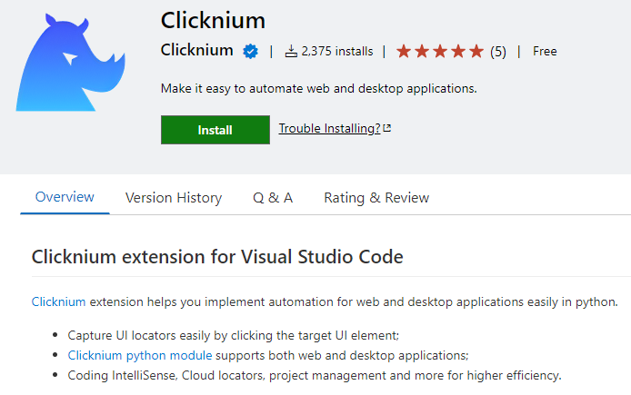
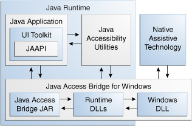

[Clicknium](https://www.clicknium.com/) offers automation technology for a variety of uses. It can handle several forms of automation, including SAP automation, Java automation, Windows desktop automation, and image automation. Let's discuss about the automation technology that underlies.

# Introduction

Regarding software automation technology, it was mainly used for software testing at the earliest, especially when it comes to UI automation testing. Many system software designs take into account how to make it accessible to people with disabilities. See [windows accessibility](https://www.microsoft.com/en-us/accessibility/?rtc=1). In recent years, RPA (Robotic Process Automation) has been accepted by more and more enterprises. RPA can play a great role in multiple business field scenarios. process, to reduce costs and increase efficiency for enterprises, and quickly improve the level of informatization. RPA products generally include automated operation components for various software, data processing components, process logic control components, etc., of which UI automation components are the most used.

# Windows UI Automation Technology

Windows applications include such a functional design: Accessibility, how to allow more people to operate and use the software, such as how to allow the blind to use, read the screen through voice, etc. The UI automation technology provided by Microsoft can access the control elements of the windows application. The main technologies are as follows:
- UIA (UI Automation) 
UI Automation provides programmatic access to information about the user interface (UI) for Microsoft windows, enabling assistive technology products (such as screen readers) to provide information about the UI to end users using means other than standard input and Manipulate UI. UI Automation also enables automated test scripts to interact with the UI.
- MSAA（Microsoft Active Accessibility）
Microsoft Active Accessibility was the earlier application accessibility solution from Microsoft. 

UIA is the new accessibility model for Microsoft Windows, offers many improvements over MSAA.

||UIA|MSAA|
|--------|---------|-------|
|Programing Languages| written in managed code, client applications are most easily programmed using C# | based on the Component Object Model (COM) with support for dual interfaces.|
|Windows Presentation Foundation|full support |WPF do not contain native support for MSAA|
|Servers and Clients|a core service lies between the server (called a provider) and the client, expose more information to client|servers and clients communicate directly, largely through the server's implementation of IAccessible|
|Security|UIA removes the need for providers to call through to other provider code. The UI Automation core service does all the necessary aggregation.|Some IAccessible customization scenarios require wrapping a base IAccessible and calling through to it. This has security implications, since a partially trusted component should not be an intermediary on a code path.|

If you are interested in Windows automation technology, you can directly read [Microsoft's official technical documentation](https://docs.microsoft.com/zh-CN/dotnet/framework/ui-automation/ui-automation-overview).

# Java Access Bridge (JAB)
Java Access Bridge is a technology that exposes the Java Accessibility API in a Microsoft Windows DLL, enabling Java applications and applets that implement the Java Accessibility API to be visible to assistive technologies on Microsoft Windows systems. Java Accessibility API is part of Java Accessibility Utilities, which is a set of utility classes that help assistive technologies provide access to GUI toolkits that implement the Java Accessibility API.
This is the architecture of Java Access Bridge from oracle official site:



To learn more about JAB, please visit [oracle](https://docs.oracle.com/javase/8/docs/technotes/guides/access/jab/introduction.html#jab-overview)

# Web Automation
Web automation mainly depends on the type of browser, currently there are two main categories:

## Internet Explorer(IE)  

Through javascript injection, the difficulty is that there are too many versions of IE, and it is still technically difficult to make multiple versions of IE compatible.

## Chromium-based browsers

There are generally three ways:
- Selenium webdriver

To learm more about webdriver, please visit [WebDriver](https://w3c.github.io/webdriver/), [Chrome webdriver](https://chromedriver.chromium.org/).

- Chrome devtool protocol(CDP)

Many tools use CDP, see [awesome-chrome-devtools](https://github.com/ChromeDevTools/awesome-chrome-devtools).
Related to web automation testing are Puppeteer, Playwright.
The following is the playwright python code to start the Chrome browser:
```python
browser = p.chromium.launch(channel="chrome", headless=False)
context = browser.new_context()
# Open new page
page = context.new_page()
# Go to https://www.google.com/
page.goto("https://www.google.com/")
```
Using ProcessExplorer, you can see that the chrome start parameters are as follows,
```
"C:\Program Files\Google\Chrome\Application\chrome.exe" --disable-background-networking --enable-features=NetworkService,NetworkServiceInProcess --disable-background-timer-throttling --disable-backgrounding-occluded-windows --disable-breakpad --disable-client-side-phishing-detection --disable-component-extensions-with-background-pages --disable-default-apps --disable-dev-shm-usage --disable-extensions --disable-features=ImprovedCookieControls,LazyFrameLoading,GlobalMediaControls,DestroyProfileOnBrowserClose,MediaRouter,AcceptCHFrame,AutoExpandDetailsElement --allow-pre-commit-input --disable-hang-monitor --disable-ipc-flooding-protection --disable-popup-blocking --disable-prompt-on-repost --disable-renderer-backgrounding --disable-sync --force-color-profile=srgb --metrics-recording-only --no-first-run --enable-automation --password-store=basic --use-mock-keychain --no-service-autorun --export-tagged-pdf --no-sandbox --user-data-dir=C:\Users\test\AppData\Local\Temp\playwright_chromiumdev_profile-V3LZUg **--remote-debugging-pipe** --no-startup-window
```
According to the chrome startup parameter description:
```
--remote-debugging-pipe: Enables remote debug over stdio pipes [in=3, out=4]. Optionally, specifies the format for the protocol messages, can be either "JSON" (the default) or "CBOR"
```

How to use CDP, you can get started from [this link](https://github.com/aslushnikov/getting-started-with-cdp/blob/master/README.md).
More crhome startup parameters can be found in the official documentation, or [here](https://github.com/GoogleChrome/chrome-launcher/blob/master/docs/chrome-flags-for-tools.md).
- Native messaging
Extensions and apps can exchange messages with native applications using an API that is similar to the other [message passing APIs](https://developer.chrome.com/docs/apps/nativeMessaging/messaging). Native applications that support this feature must register a native messaging host that knows how to communicate with the extension. Chrome starts the host in a separate process and communicates with it using standard input and standard output streams.

More about Native Messaging, please visit [this link](https://developer.chrome.com/docs/apps/nativeMessaging/messaging).

#  SAP Automation
SAP itself provides script automation, so most RPA products automate SAP applications based on the automation technology provided by SAP itself.

- Automated supplementary technology
In addition to the above native automation technologies, the following automation technologies are generally used to achieve hybrid automation
  - Image recognition, shortcut keys
  - OCR
  - Screen word picking
  - computer vision
  - Windows Native API

# What Clicknium Do
Utilizing the aforementioned automation technologies, Clicknium offers development tools that allow users to: 
- capture UI elements and store them as locators or selectors.
- a single Python API to automate all application kinds.
- Higher efficiency in writing code with locator IntelliSense.

In addition to utilizing the aforementioned automation technologies, Clicknium also performs other enhancements: 
- Combining various automation technologies to increase robustness.
- A fast searching algorithm to find the UI component.
- Algorithm for generating locators.
- ... ...

You can visit [Clicknium Visual Studio Code Extension change log](https://marketplace.visualstudio.com/items/ClickCorp.clicknium/changelog) to see more functionalities.