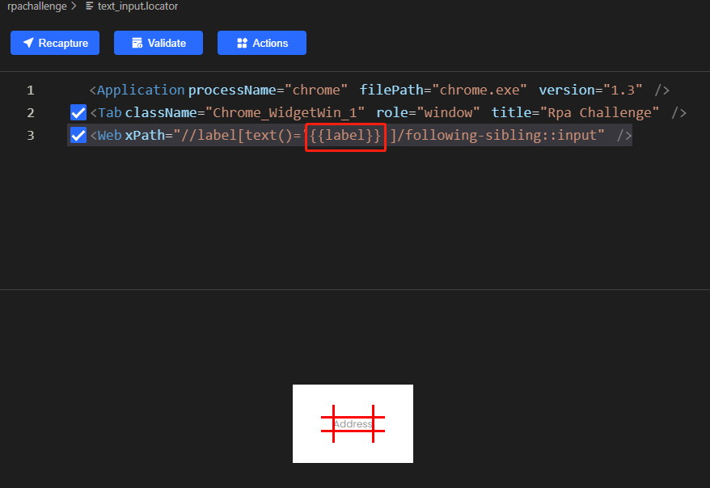

# Clicknium Automation Sample Solution - RPA challenge: input forms

This is a sample of RPA challenge with [clicknium](https://www.clicknium.com/) web automation.
The goal of this challenge is to create a workflow that will input data from a spreadsheet into the form fields on the screen.
The fields will change position on the screen after every submission throughout 10 rounds thus the workflow must correctly identify where each spreadsheet record must be typed every time.

You will see that clicknium complete the challenge within 2 seconds.

# Run this sample
- follow [Clicknium getting started](https://www.clicknium.com/documents) to set up development environment.
- clone [sample repo](https://github.com/clicknium/clicknium-samples).
```
git clone https://github.com/clicknium/clicknium-samples.git
```
- open the folder 'rpachallenge' in Visual Studio code.
- through `pip` install the dependent packages.
  
`requests` is used to download the excel file and `pandas` is used to read excel file.

```
pip install requests
pip install pandas
```

- open `input_forms.py` in Visual Studio Code.
- press `F5` to debug the sample or press `CTRL+F5` to run sample.

You will see the result as below:


# The Process of the sample
- open the RPA challenge web portal.
- get the url of excel file.
- download the excel file.

```python
tab = cc.chrome.open("https://rpachallenge.com/")
tab.find_element(locator.chrome.rpachallenge.a_inputforms).click()
href = tab.find_element(locator.chrome.rpachallenge.a_downloadexcelcloud_download).get_property("href")
url = os.path.join("https://rpachallenge.com/", href)
excelFile = requests.get(url)
temp_file = os.path.join(os.getcwd(), 'challenge.xlsx')
open(temp_file, 'wb').write(excelFile.content)
data = pd.read_excel(temp_file)
```

- click 'START' to begin the chanllenge.
- iterate the records in excel file and fill the properties to the correct input box.
The most difficulty of this challenge is 'The fields will change position on the screen after every submission', we find that the text of label is stable, for example: 'Address', 'Company Name'. To make locator robust, we record locator as the following steps:
  - using 'xpath' mode to record the label.  
  
The locator of the label is:


- based on the sinfo of the label, update the xpath,make it point to the following-sibling input.  


Then we can use the same way to generate locator for other 'input' element,  but it is boring, clicknium suppuort [parametric locator](https://www.clicknium.com/documents/concepts/parametric_locator)，we can set the label text as parameter 'label':


The we can use one locator to fill all input element during running, code is as the following:

```python
tab.find_element(locator.chrome.rpachallenge.button_start).click()
for idx, item in data.iterrows():
    tab.find_element(locator.chrome.rpachallenge.text_input, {'label':'First Name'}).set_text(item[0])
    tab.find_element(locator.chrome.rpachallenge.text_input, {'label':'Last Name'}).set_text(item[1])
    tab.find_element(locator.chrome.rpachallenge.text_input, {'label':'Company Name'}).set_text(item[2])
    tab.find_element(locator.chrome.rpachallenge.text_input, {'label':'Role in Company'}).set_text(item[3])
    tab.find_element(locator.chrome.rpachallenge.text_input, {'label':'Address'}).set_text(item[4])
    tab.find_element(locator.chrome.rpachallenge.text_input, {'label':'Email'}).set_text(item[5])
    tab.find_element(locator.chrome.rpachallenge.text_input, {'label':'Phone Number'}).set_text(str(item[6]))
    tab.find_element(locator.chrome.rpachallenge.submit_submit).click()
```


# Locator
The [Locator](https://www.clicknium.com/documents/concepts/locator) is the identifier of a UI element, which can be recorded and edited in [clicknium vs code extension](https://marketplace.visualstudio.com/items?itemName=ClickCorp.clicknium). 

In this sample, you can open the locator in Visual Studio Code, for example:
	
Clicknium will automatically select the attribute to identify web element, and show all attributes of this element. It is easy to choose other attributes in Visual Studio Code as well as you want.

Then copy the locator 
# More samples
You can refer to more automation samples/solutions in [clicknium github samples](https://github.com/clicknium/clicknium-samples).

Send [email](mailto:support@clicknium.com) to us or [Join Slack](https://join.slack.com/t/clicknium/shared_invite/zt-1cfxsstw7-s0CeJdhyg5wQ1h7_KKc6QQ).
